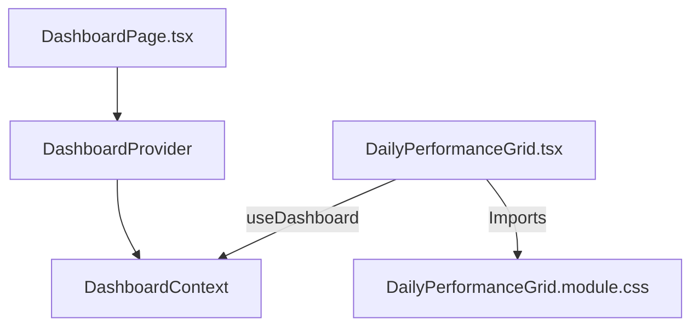

# Feature Technical Specification: Daily Performance Grid

## Status

Status: Confirmed

Last updated: 2026-06-06

Owner or primary stakeholder: lucas.dourado

## Product Name

Analysis.GG

## Feature Reference

`docs/features/daily-performance-grid/feature.md`

Target output path: `docs/features/daily-performance-grid/tech-spec.md`

## Source Documents

| Source | Location or Reference | Type | Status | Notes |
| --- | --- | --- | --- | --- |
| Feature | `docs/features/daily-performance-grid/feature.md` | Feature | Confirmed | Primary feature source |
| Project Planning | `docs/planning/analysis-gg/project-planning.md` | Planning | Confirmed | MVP context, phases, dependencies |
| Technology Definition | `docs/architecture/analysis-gg/technology-definition.md` | Technology definition | Confirmed | Confirmed stack and constraints |

## Specification Scope

Covers the design, data mapping, state integration, styling, and test verification strategy for the `DailyPerformanceGrid` component on the player dashboard page.

## Feature Summary

The Daily Performance Grid provides a visual representation of a player's recent ranked games, grouped by calendar date. It displays a sequential, 30-day calendar-like grid ending at the date of the user's latest played match. Each cell is color-coded to reflect the win/loss record of that day, featuring interactive tooltips to show exact wins and losses on hover.

## Feature Goal

Display a calendar/grid layout representing games played, wins, and losses on a daily basis (similar to GitHub contributions grid) to help players spot daily performance trends and hot/cold streaks.

## Product Completion Criteria

- [x] Daily groupings display chronological order.
- [x] Cells represent correct game counts and win/loss outcomes.
- [x] Color rules map correctly (e.g. green for wins > losses, red for losses > wins, mixed for tied).
- [x] Responsive behavior holds for mobile screen widths.

## Technical Goals

- Map epoch millisecond timestamps (`gameCreation`) from Riot matches to localized date strings (`YYYY-MM-DD`) without timezone shift anomalies.
- Dynamically build a rolling 30-day window ending on the day of the latest match found in the filtered list.
- Implement responsive layout rendering using CSS Grid (`grid-template-columns: repeat(10, 1fr)`) to display cells cleanly on mobile viewports.
- Configure interactive tooltips showing precise game tallies (e.g., `Jun 3, 2026: 3W - 1L (Winning Day)`) on cell hover.
- Set up unit/component tests in Vitest validating date windowing, record aggregation, status mapping, tooltips, and empty states.

## Non-Goals

- Linking grid cells to open specific match history details or external matches.
- Providing infinite scrolling or date window configuration (e.g. 60 or 90 days).

## Confirmed Technology Decisions

| Area | Decision | Source | Applies To | Notes |
| --- | --- | --- | --- | --- |
| Frontend Framework | React (Vite + TS) | `technology-definition.md` | Component structure | standard SPA structure |
| UI Styling | Vanilla CSS Modules | `technology-definition.md` | Component styling | Uses variables from `index.css` |
| State Management | React Context API | `technology-definition.md` | Data supply | Subscribes to `DashboardContext` |

## Pending Technology Decisions

| Area | Pending Decision | Impact on Feature | Required Next Step |
| --- | --- | --- | --- |
| None | None | None | None |

## Applicable Guidelines and References

| Reference | Path | Applies To | Usage |
| --- | --- | --- | --- |
| Frontend Guidelines | `.agents/docs/architecture/react-coding-guidelines/` | React and CSS code | Dictates React modularity, hooks usage, and CSS modules naming |

## Proposed Technical Approach

The component subscribes to `DashboardContext` using the `useDashboard()` hook to get the `filteredMatches` array. It performs high-performance local client-side grouping and aggregation within a React `useMemo` hook to ensure efficiency.

### Date Window Generation
- Identify the latest timestamp from the matches: `Math.max(...filteredMatches.map(m => m.gameCreation))`.
- Generate a chronologically ascending 30-day calendar array (formatted as `YYYY-MM-DD` strings) ending on that date.
- Initialize each day with 0 wins and 0 losses.

### Record Grouping & Classification
- Convert each match's `gameCreation` timestamp to `YYYY-MM-DD` relative to the local browser timezone.
- Aggregate win/loss counts per date.
- Classify each date cell into one of four statuses:
  - `none`: 0 games played.
  - `win`: wins > losses.
  - `loss`: losses > wins.
  - `tie`: wins == losses (where total games > 0).

## Architecture Notes



- **File Location**: `src/main/frontend/src/features/dashboard/presentation/components/DailyPerformanceGrid.tsx`
- **Styles Location**: `src/main/frontend/src/features/dashboard/presentation/components/DailyPerformanceGrid.module.css`

## Modules and Responsibilities

| Module or Component | Responsibility | Inputs | Outputs | Notes |
| --- | --- | --- | --- | --- |
| `DailyPerformanceGrid` | React Component rendering the grid | `filteredMatches` from Context | JSX markup with interactive grid cells | Main presentation entry point |
| `getLocalDateString` | Helper utility converting timestamp to `YYYY-MM-DD` | `timestamp: number` | `string` | Local timezone calculation |
| `formatDateLabel` | Helper utility formatting date strings for tooltips | `dateStr: string` (`YYYY-MM-DD`) | `string` (e.g. `Jun 3, 2026`) | Localized display formatting |

## Integration Contracts

| Producer | Consumer | Contract | Notes |
| --- | --- | --- | --- |
| `DashboardContext` | `DailyPerformanceGrid` | Provides `filteredMatches: MatchSummary[]` | Triggers grid update when filter changes |

## Data Model

`Not applicable`. This component does not introduce or modify persistent models.

## Data Contracts

### DayRecord

The data structure representing a cell in the 30-day grid:

```typescript
interface DayRecord {
  date: string;          // YYYY-MM-DD
  formattedDate: string; // e.g. Jun 3, 2026
  wins: number;          // Daily wins count
  losses: number;        // Daily losses count
  status: 'win' | 'loss' | 'tie' | 'none';
}
```

## API or Interface Design

### React Component Interface

```typescript
export const DailyPerformanceGrid: React.FC = () => { ... }
```

- **Props**: None. Reads data directly from `useDashboard()`.

## State and Error Handling

| State or Error | Trigger | Expected Behavior | User/System Feedback | Notes |
| --- | --- | --- | --- | --- |
| Loading | Match sync is pending | Page-level spinner is displayed | "Synchronizing Riot API match history..." | Handled at page level |
| Success | Matches loaded successfully | Group and display the 30-day grid with legends and tooltips | Color-coded grid cells showing match distribution | Standard active state |
| Empty | No matches are returned or filter excludes all | Render standard message fallback | "No match records to display." | Prevents rendering crash |
| Error | Riot API or network sync fails | Page-level error screen is displayed | "Analysis Refused: [Reason]" | Handled at page level |

## Validation Rules

`Not applicable`. No inputs are captured by this component.

## Security and Permissions

`Not applicable`. Pure presentation component.

## Observability and Logging

- Unexpected Date Formats: If timestamp conversion returns `NaN` or invalid dates, log the mismatch to browser client console.

## Performance Considerations

- Grouping matches is performed using `useMemo` dependent on `filteredMatches`. With `filteredMatches` limited to a maximum length of 100 elements, this calculation executes in under ~1ms.
- Rendered elements are stable: 30 cells are mapped, ensuring lightweight DOM representation and fast layout reflows.

## Compatibility and Migration Notes

- CSS Modules and CSS Grid (`grid-template-columns: repeat(10, 1fr)`) are widely compatible across modern mobile and desktop browsers.
- The use of `aspect-ratio: 1` ensures cells remain perfectly square on resizing without JavaScript layout listeners.

## Testing Strategy

| Test Type | What to Validate | Required? | Notes |
| --- | --- | --- | --- |
| Unit | Empty state rendering when matches array is empty | Yes | Should show "No match records to display." |
| Unit | Grouping math and status calculations (`win`, `loss`, `tie`, `none`) | Yes | Inject specific match outcomes and verify CSS class associations |
| Unit | Dynamic 30-day rolling window bounds | Yes | Verify that grid items span exactly 30 days ending on the day of the latest match |
| Unit | Custom tooltip content generation | Yes | Validate tooltip strings for empty days vs played days |

## Risks and Trade-offs

| Risk or Trade-off | Impact | Likelihood | Mitigation or Follow-Up | Status |
| --- | --- | --- | --- | --- |
| 30-day window limit for sparse match histories | Low | Medium | If a player has only 10 matches spread over 6 months, the grid will only show 30 days leading to the latest match (leaving older ones out). This matches the MVP scope and is accepted. | Accepted |
| Grid spacing/size on very small viewports | Medium | Low | Use `grid-template-columns: repeat(10, 1fr)` with dynamic gap size and scale hovering within viewport bounds. | Mitigated |

## Assumptions

- We assume match objects supplied by context always have a valid `gameCreation` timestamp.

## Open Questions

- None. The 30-day layout and color mappings are confirmed.

## Feature Technical Readiness

Status: Ready for Task Breakdown

Reason: The visual layout is defined, the required calculations are scoped, the component properties match existing models, and a clear test plan is ready.

## Feature Technical Readiness Checklist

- [x] Feature scope is clear.
- [x] Product completion criteria are understood.
- [x] Technology decisions are confirmed.
- [x] Applicable guidelines and references are listed.
- [x] Integration contracts are defined or marked as not applicable.
- [x] Data model is defined or marked as not applicable.
- [x] Data contracts are defined or marked as not applicable.
- [x] State and error handling are defined.
- [x] Validation rules are defined or marked as not applicable.
- [x] Security/permission considerations are defined or marked as not applicable.
- [x] Testing strategy is defined.
- [x] Blocking open questions are resolved.
- [x] Inputs for `create-tasks` are clear.

## Inputs for Create Tasks

- Create task for verifying existing layout and styling alignment with `feature.md`.
- Create task for implementing Vitest unit/component tests in `src/main/frontend/src/features/dashboard/presentation/components/DailyPerformanceGrid.test.tsx`.
- Create task for feature completion validation.

## ADR Candidates

- None.

## Next Recommended Steps

- Proceed to the `create-tasks` workflow to generate implementation/testing tasks for the feature.
