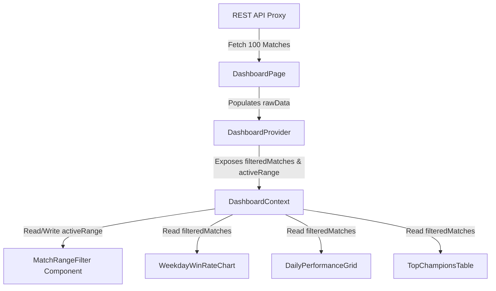

# Feature Technical Specification: Match Range Filter

## Status

Status: Confirmed
Last updated: 2026-06-06
Owner or primary stakeholder: lucas.dourado

## Product Name

Analysis.GG

## Feature Reference

`docs/features/match-range-filter/feature.md`

Target output path: `docs/features/match-range-filter/tech-spec.md`

## Source Documents

| Source | Location or Reference | Type | Status | Notes |
| --- | --- | --- | --- | --- |
| Feature | [feature.md](file:///c:/Users/lucas.dourado/IdeaProjects/analysis-gg/docs/features/match-range-filter/feature.md) | Feature | Confirmed | Primary feature source |
| Project Planning | [project-planning.md](file:///c:/Users/lucas.dourado/IdeaProjects/analysis-gg/docs/planning/analysis-gg/project-planning.md) | Planning | Confirmed | MVP context, phases, dependencies |
| Technology Definition | [technology-definition.md](file:///c:/Users/lucas.dourado/IdeaProjects/analysis-gg/docs/architecture/analysis-gg/technology-definition.md) | Technology definition | Confirmed | Confirmed stack and constraints |

## Specification Scope

This technical specification covers the frontend state management, dropdown component design and styling, local slicing logic, and integration coordinates within the React-based Dashboard of the **Analysis.GG** application.

## Feature Summary

The Match Range Filter allows players to scope the dashboard's analytics to the last 20, 50, or 100 matches. The frontend fetches up to 100 matches from the Spring Boot backend proxy in a single call and filters them client-side. Selecting an option updates the active filtered match list and triggers immediate visual recalculation of all dependent widgets (win rates, tables, and charts).

## Feature Goal

Provide an interactive selector on the dashboard allowing the user to filter the scope of analyzed ranked games to the last 20, 50, or 100 matches.

## Product Completion Criteria

- [ ] Dropdown element is accessible in dashboard header.
- [ ] Selecting "Last 20" updates all widgets with calculations of the 20 most recent games.
- [ ] Selecting "Last 50" updates all widgets with calculations of the 50 most recent games.
- [ ] Selecting "Last 100" updates all widgets with calculations of the 100 most recent games.

## Technical Goals

- Implement a premium visual selector for match count ranges (Obsidian dark-theme design tokens, CSS Modules, clean hover and transition styles).
- Centralize active range state using React Context API to propagate the filtered data to all dashboard widgets.
- Implement client-side slicing logic (`slice(0, Math.min(rawData.length, selectedRange))`).
- Handle cases where the player has fewer games than the selected range option by dynamically adjusting option labels to show available count, e.g., "Last 50 (35 available)", while keeping them clickable.
- Optimize dashboard calculations using `useMemo` hooks inside the widgets to prevent redundant calculations on parent re-renders.

## Non-Goals

- Persisting the selected filter range in a database or local storage (resets to default "Last 20" on page refresh).
- Filtering games by queue type or dates.
- Requesting fewer matches from the backend when the filter changes (always request up to 100 matches to support local filtering).

## Confirmed Technology Decisions

| Area | Decision | Source | Applies To | Notes |
| --- | --- | --- | --- | --- |
| **Frontend Framework** | React (Vite + TS) | `technology-definition.md` | Whole frontend | Type-safe React components |
| **State Management** | React Context API | `technology-definition.md` | Dashboard state | Shared context provider for widgets |
| **Styling** | Vanilla CSS (CSS Modules) | `technology-definition.md` | MatchRangeFilter component | Dynamic dropdown styling sheets |
| **Performance** | React `useMemo` hooks | `technology-definition.md` | Widgets calculations | Avoid re-render computations |

## Pending Technology Decisions

| Area | Pending Decision | Impact on Feature | Required Next Step |
| --- | --- | --- | --- |
| None | None | None | None |

## Applicable Guidelines and References

| Reference | Path | Applies To | Usage |
| --- | --- | --- | --- |
| React Coding Guidelines | [.agents/docs/architecture/react-coding-guidelines/](file:///c:/Users/lucas.dourado/IdeaProjects/analysis-gg/.agents/docs/architecture/react-coding-guidelines/) | Component structure | Project-wide frontend layout |
| Component Guidelines | [.agents/docs/architecture/react-coding-guidelines/component-guidelines.md](file:///c:/Users/lucas.dourado/IdeaProjects/analysis-gg/.agents/docs/architecture/react-coding-guidelines/component-guidelines.md) | Component modularity | UI and state separation |
| State Management | [.agents/docs/architecture/react-coding-guidelines/state-management.md](file:///c:/Users/lucas.dourado/IdeaProjects/analysis-gg/.agents/docs/architecture/react-coding-guidelines/state-management.md) | State strategy | Local & context separation |
| Styling Guidelines | [.agents/docs/architecture/react-coding-guidelines/styling-guidelines.md](file:///c:/Users/lucas.dourado/IdeaProjects/analysis-gg/.agents/docs/architecture/react-coding-guidelines/styling-guidelines.md) | CSS design | CSS modules & tokens |

## Proposed Technical Approach

### Folder Layout
```txt
src/features/dashboard/
  presentation/
    context/
      DashboardContext.tsx        # Context provider, state definitions
    components/
      MatchRangeFilter.tsx        # Dropdown component
      MatchRangeFilter.module.css # Styling sheet for dropdown
    pages/
      DashboardPage.tsx           # Page entry, connects context to page layout
```

### Data Flow


### Context & State Management
`DashboardContext.tsx` exposes:
- `rawData`: `MatchSummary[]` (fetched from API in page)
- `activeRange`: `number` (active filter, default: 20)
- `setActiveRange`: `(range: number) => void`
- `filteredMatches`: `MatchSummary[]` (derived and memoized)

Slicing logic:
```typescript
const filteredMatches = useMemo(() => {
  if (!rawData) return [];
  return rawData.slice(0, Math.min(rawData.length, activeRange));
}, [rawData, activeRange]);
```

### Dropdown Option Label Resolution
Let $N$ be the length of `rawData`.
For each option $X \in \{20, 50, 100\}$:
- If $N \ge X$, render label as `"Last " + X` (e.g. "Last 50").
- If $N < X$, render label as `"Last " + X + " (" + N + " available)"` (e.g. "Last 50 (35 available)").
- Dropdown options are always active, clicking them sets `activeRange` to $X$.

## Modules and Responsibilities

| Module or Component | Responsibility | Inputs | Outputs | Notes |
| --- | --- | --- | --- | --- |
| `DashboardProvider` | Holds raw and active range state; exposes Context. | `rawData` | JSX Provider | Wraps the dashboard layout |
| `MatchRangeFilter` | Select dropdown displaying available options and updating context. | Context values | JSX Dropdown UI | Placed in page header |
| `DashboardPage` | Entry point, fetches data from API, renders layout inside provider. | None | JSX Layout | Coordinates the view |

## Integration Contracts

No backend changes are needed. The component interacts with the backend's `/api/summoner/{gameName}/{tagLine}` response which already contains up to 100 matches in a JSON array.

## Data Model

`Not applicable` — Feature is client-side only.

## Data Contracts

`Not applicable` — No new server API contracts are defined.

## State and Error Handling

| State or Error | Trigger | Expected Behavior | User/System Feedback |
| --- | --- | --- | --- |
| **Initial Loading** | Page first loads, data is fetching | Disable dropdown selector | Selector is grayed out or replaced by a subtle skeleton state |
| **Data Loaded** | API request completes successfully | Enable dropdown, default selection to 20 | Dropdown is active, default option is selected |
| **Empty Match History** | API returns 0 matches | Disable dropdown selector, default to 0 available | Dropdown is disabled, displays "No matches available" |
| **Option Selection** | User clicks "Last 50" | Update context state `activeRange`, trigger re-computation | Visual transition of dropdown selection, dashboard widgets update immediately |

## Validation Rules

- Dropdown only allows selections of `20 | 50 | 100`.
- Slicing logic defends against empty arrays or null values in `rawData`.

## Security and Permissions

No sensitive data is processed. Slicing is client-side and secure.

## Observability and Performance

- Widgets must wrap their data aggregation in `useMemo` using `filteredMatches` as dependency to avoid lag during filter switches.
- Standard React rendering profiling to confirm no double renders.

## Testing Strategy

- **Unit**: Verify slicing logic returns exact sub-arrays under different sizes (e.g., rawData size 15, 35, 120).
- **Unit**: Verify dropdown option label string builder (e.g., formats "Last 50 (35 available)" when total is 35).
- **Integration**: Verify that selecting a new option in `MatchRangeFilter` changes `filteredMatches` in the `DashboardProvider` and updates consumer component outputs.

## Risks and Trade-offs

- **Risk**: User has 0 matches.
  - *Mitigation*: Dropdown is disabled and displays "No matches available".
- **Risk**: Performance lag on low-end devices due to DOM re-renders of widgets.
  - *Mitigation*: Ensure all chart and list components use memoization and light DOM trees.

## Feature Technical Readiness

Status: Ready for Task Breakdown
Reason: The state layout, React context flow, slicing logic, dynamic labeling, styling modules, and testing boundaries are fully defined and aligned.

## Feature Technical Readiness Checklist

- [x] Feature scope is clear.
- [x] Product completion criteria are understood.
- [x] Technology decisions are confirmed.
- [x] Applicable guidelines and references are listed.
- [x] Integration contracts are defined.
- [x] Data model is marked as not applicable.
- [x] Data contracts are defined.
- [x] State and error handling are defined.
- [x] Validation rules are defined.
- [x] Security/permission considerations are defined.
- [x] Testing strategy is defined.
- [x] Blocking open questions are resolved.
- [x] Inputs for `create-tasks` are clear.

## Inputs for Create Tasks

- Create tasks for context and provider implementation.
- Create tasks for selector dropdown UI component and styling.
- Create tasks for integrating dropdown into header.
- Create tasks for widget integration and optimization.
- Create tasks for unit/integration tests.
- Create tasks for feature completion verification.

## ADR Candidates

| Candidate ADR | Decision Area | Status | Reason |
| --- | --- | --- | --- |
| None | None | None | None |

## Next Recommended Steps

- Run the `create-tasks` workflow to break down this specification into actionable implementation tasks under `docs/features/match-range-filter/tasks/`.
