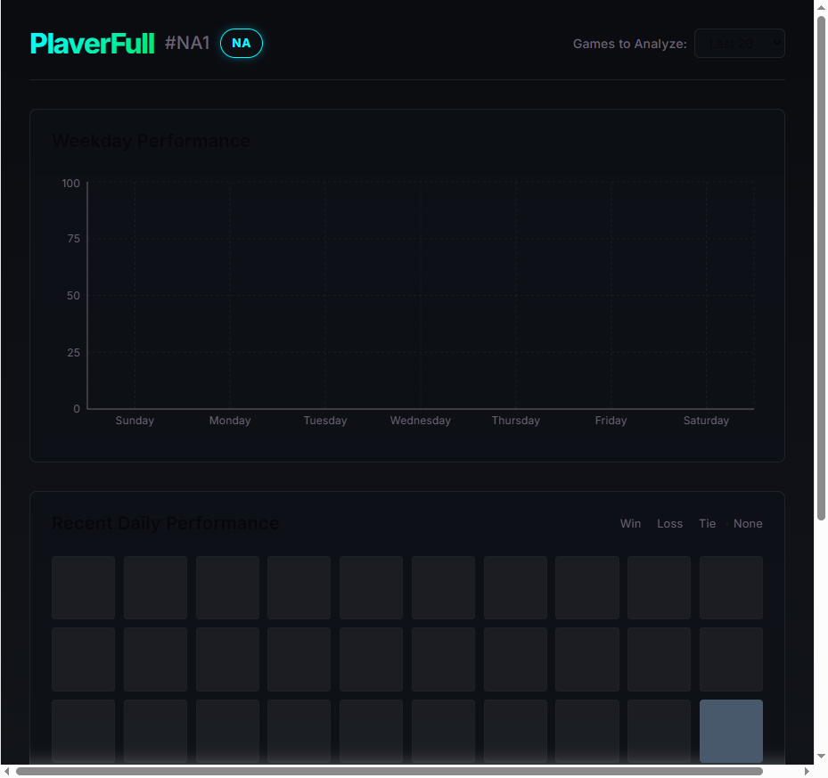
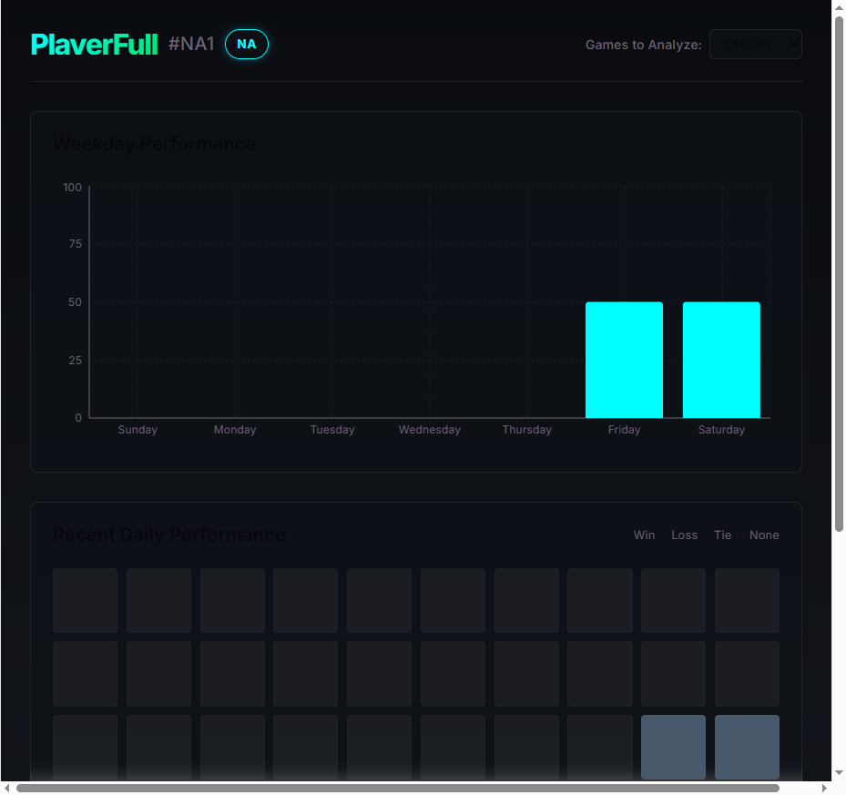
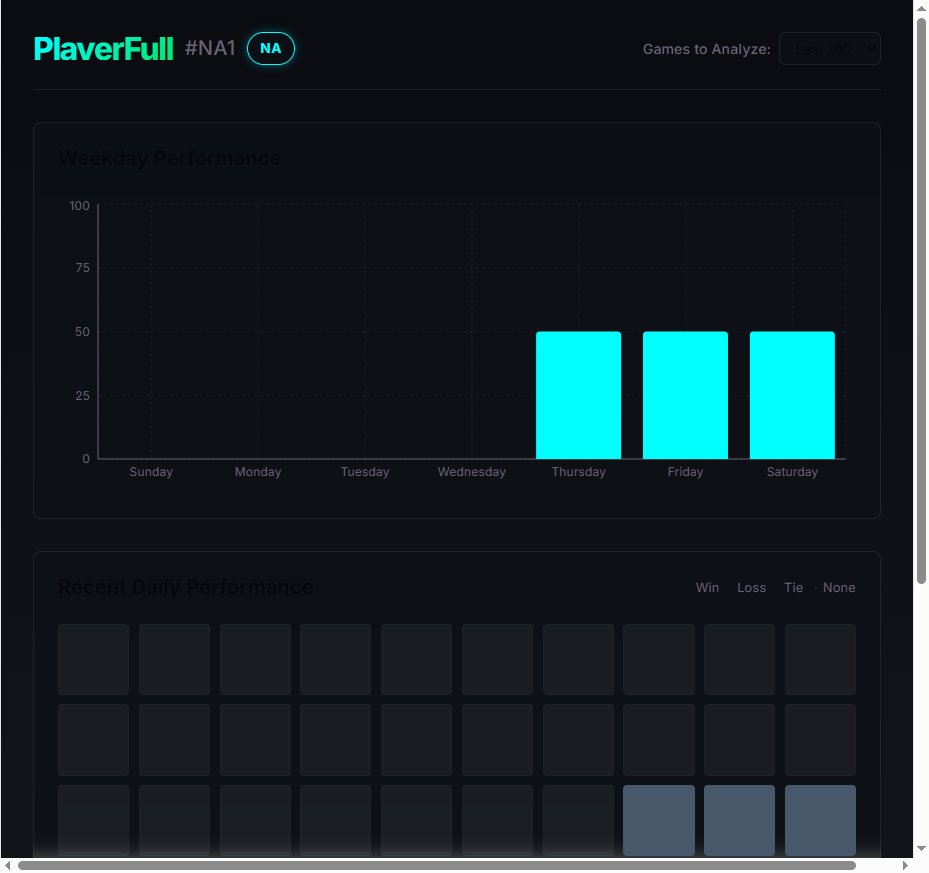
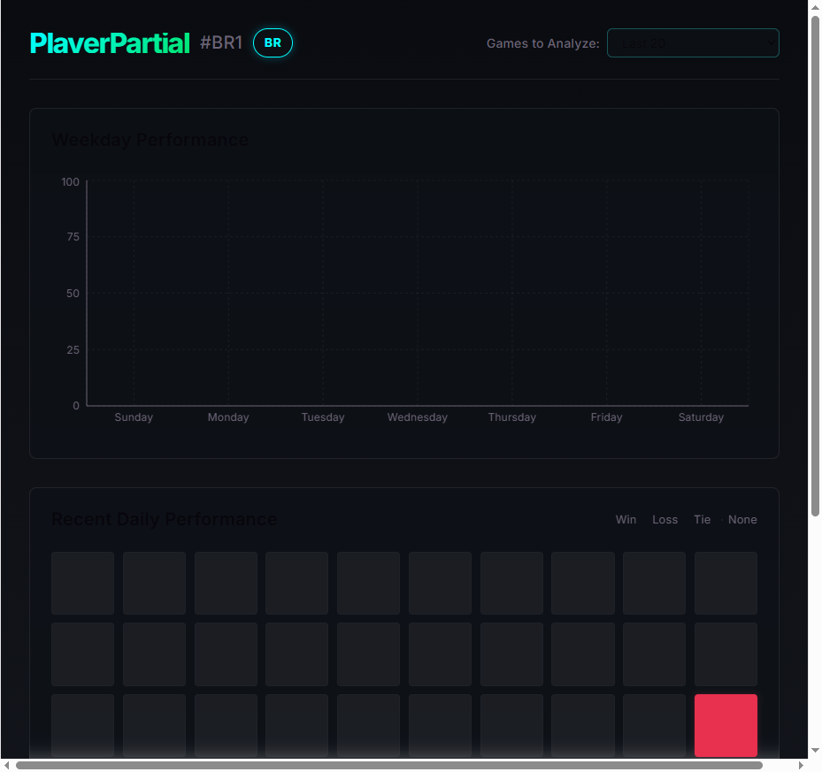

# Walkthrough: Match Range Filter Feature Verification

This walkthrough summarizes the end-to-end verification and successful implementation of the **Match Range Filter** feature for the **analysis-gg** dashboard.

## Changes Made
- **Tests Adjustment**: Performed a small technical adjustment in [DashboardContext.test.tsx](file:///c:/Users/lucas.dourado/IdeaProjects/analysis-gg/src/main/frontend/src/features/dashboard/presentation/context/DashboardContext.test.tsx#L1) to remove an unused `React` import statement that was causing TypeScript compilation errors during the production build step. No functional code modifications were made, preserving the exact context and components implemented in previous tasks.

---

## Verification Summary

### 1. Automated Unit Tests (Vitest)
Ran the test suite locally in the frontend workspace. All 15 tests (including the 10 context/slicing/label unit tests) passed successfully.
- **Command**: `npm.cmd run test -- --run`
- **Output**:
  ```text
  RUN  v4.1.8 C:/Users/lucas.dourado/IdeaProjects/analysis-gg/src/main/frontend

   ✓ src/features/dashboard/presentation/context/DashboardContext.test.tsx (10 tests) 313ms
   ✓ src/features/search/presentation/components/SearchForm.test.tsx (5 tests) 337ms

   Test Files  2 passed (2)
        Tests  15 passed (15)
     Start at  12:39:15
     Duration  3.66s
  ```

### 2. Production Bundle Compilation (Vite + TypeScript)
Validated that the production build compiles cleanly without TypeScript or bundler errors.
- **Command**: `npm.cmd run build`
- **Output**:
  ```text
  vite v8.0.16 building client environment for production...
  transforming...✓ 631 modules transformed.
  rendering chunks...
  dist/index.html                   0.45 kB
  dist/assets/index-DMErkh2N.css   12.39 kB
  dist/assets/index-pKHpMxgp.js   669.26 kB
  ✓ built in 665ms
  ```

### 3. Browser E2E Verification (Playwright)
Conducted automated browser verification using the Playwright MCP server by mocking Riot API summoner analytics endpoints for two test profiles:
- **PlayerFull#NA1** (100 matches): Verified selection of `Last 20` (default), `Last 50`, and `Last 100` options. Confirmed dashboard widgets correctly update calculations dynamically on change.
- **PlayerPartial#BR1** (35 matches): Verified dynamic label updates. Options adjusted dynamically to show the available count (`Last 50 (35 available)` and `Last 100 (35 available)`).

---

## Visual Verification (Screenshots)

- **Full History - Default 20 Matches**:
  
- **Full History - Selected 50 Matches**:
  
- **Full History - Selected 100 Matches**:
  
- **Partial History - 35 Matches Dynamic Labels**:
  

---

## Acceptance Criteria Mapping

| Acceptance Criterion | Verification Evidence | Status |
| --- | --- | --- |
| Dropdown element is accessible in dashboard header | Checked presence and clickability of `#match-range-select` element | **Covered** |
| Selecting "Last 20" updates all widgets with calculations of the 20 most recent games | Default selected range is 20; stats display based on 20 matches (`walkthrough-full-20.png`) | **Covered** |
| Selecting "Last 50" updates all widgets with calculations of the 50 most recent games | UI stats recalculate instantly on option select (`walkthrough-full-50.png`) | **Covered** |
| Selecting "Last 100" updates all widgets with calculations of the 100 most recent games | UI stats recalculate instantly on option select (`walkthrough-full-100.png`) | **Covered** |
| No regression or visual glitches occur during selector transitions | Monitored UI transitions during automated option selection | **Covered** |
| Visual designs align with Obsidian dark-theme rules | Layout, fonts, border-radius, background, and dark-theme tokens are correct | **Covered** |
| Option labels dynamically adjust to show available count when matches < limit | Verified labels show `Last 50 (35 available)` and `Last 100 (35 available)` (`walkthrough-partial-labels.png`) | **Covered** |
