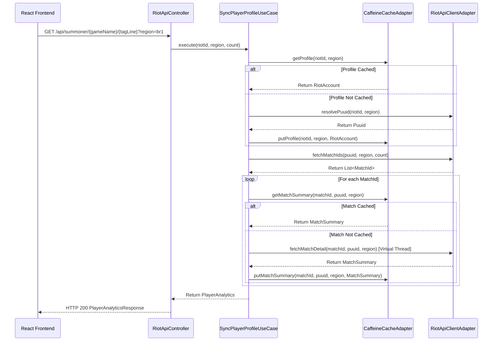

# Feature Technical Specification: player-profile-caching

## Status

Status: Confirmed

Last updated: 2026-06-06

Owner or primary stakeholder: lucas.dourado

## Product Name

Analysis.GG

## Feature Reference

`docs/features/player-profile-caching/feature.md`

Target output path: `docs/features/player-profile-caching/tech-spec.md`

## Source Documents

| Source | Location or Reference | Type | Status | Notes |
| --- | --- | --- | --- | --- |
| Feature | `docs/features/player-profile-caching/feature.md` | Feature | Confirmed | Primary feature source |
| Project Planning | `docs/planning/analysis-gg/project-planning.md` | Planning | Confirmed | MVP context, phases, dependencies |
| Technology Definition | `docs/architecture/analysis-gg/technology-definition.md` | Technology definition | Confirmed | Confirmed stack and constraints |

## Specification Scope

This specification details the backend-driven player profile and match summary caching system. It maps out the Caffeine cache configuration, data contracts, cache keys, error propagation, integration with the sync pipeline, and validation rules to ensure 15-minute data freshness for searches while preventing Riot Games API rate limit lockouts.

## Feature Summary

The Player Profile Caching feature implements an in-memory caching mechanism on the backend using the Caffeine library. It consists of two cache pools:
1. A player profile cache that expires entries 15 minutes after write to limit repeat PUUID lookups.
2. A match summary cache that stores immutable historical match data for 24 hours to accelerate the sync process for repeat lookups and reduce the volume of Match-V5 detail API calls.

## Feature Goal

Store synced profile lookup and match details for 15 minutes to reduce API traffic and ensure rapid page reloads.

## Product Completion Criteria

- [x] Checks cache validity prior to calling Riot API.
- [x] Expires data exactly after 15 minutes of store time (for player profiles).
- [x] Returns cache payload instantly on match.

## Technical Goals

- Eliminate redundant HTTP queries to Riot's Account-V1 and Match-V5 endpoints.
- Support thread-safe, high-concurrency access to cache states using Caffeine.
- Leverage Spring Boot dependency injection to decouple the caching implementation from core business logic via ports.
- Integrate cache verification directly into the `SyncPlayerProfileUseCase` sequence.

## Non-Goals

- Persistent caching using databases or Redis (cache is strictly in-memory for the MVP).
- Cache synchronization across multiple cluster nodes (MVP runs on a single JVM instance).
- Client-side cache persistence (no caching of Riot API payloads in localStorage).

## Confirmed Technology Decisions

| Area | Decision | Source | Applies To | Notes |
| --- | --- | --- | --- | --- |
| Backend Language | Java 21 | `technology-definition.md` | Java Backend | Core runtime environment |
| Framework | Spring Boot | `technology-definition.md` | Application Framework | Controller and bean container |
| Caching Library | Caffeine Cache | `technology-definition.md` | Backend Cache Provider | In-memory eviction caching |

## Pending Technology Decisions

| Area | Pending Decision | Impact on Feature | Required Next Step |
| --- | --- | --- | --- |
| None | None | None | None |

## Applicable Guidelines and References

| Reference | Path | Applies To | Usage |
| --- | --- | --- | --- |
| Backend Guidelines | `.agents/docs/architecture/coding-guidelines/README.md` | Java Module | Ports/adapters structure compliance |
| Caffeine Documentation | `docs/references/analysis-gg/technologies/caffeine.md` | Cache Config | Cache configuration and builder patterns |

## Proposed Technical Approach

The caching system is built on a clean ports-and-adapters pattern:
- **Port**: `PlayerProfileCachePort` defines the interface for checking, inserting, evicting, and clearing cache entries.
- **Adapter**: `CaffeineCacheAdapter` implements the port using two distinct Caffeine caches injected via Spring configuration:
  - `playerProfileCache`: Expires 15 minutes after write (`expireAfterWrite(15, TimeUnit.MINUTES)`), capped at `1000` entries.
  - `matchSummaryCache`: Expires 24 hours after write (`expireAfterWrite(24, TimeUnit.HOURS)`), capped at `10000` entries.
- **Interception**: Inside `SyncPlayerProfileUseCase`, before calling the Riot API client:
  1. Retrieve profile from `playerProfileCache`. If absent, fetch from Riot API and store.
  2. Query recent match IDs. For each ID, check `matchSummaryCache`.
  3. Cache misses on match details are fetched in parallel using virtual threads and populated back to `matchSummaryCache`.

## Architecture Notes



## Modules and Responsibilities

| Module or Component | Responsibility | Inputs | Outputs | Notes |
| --- | --- | --- | --- | --- |
| `CaffeineCacheConfig` | Instantiates and configures Caffeine Cache Spring Beans with specified TTL and capacity rules | None | `Cache<ProfileCacheKey, RiotAccount>`, `Cache<MatchSummaryCacheKey, MatchSummary>` | Configured in `infrastructure/cache` |
| `CaffeineCacheAdapter` | Implements `PlayerProfileCachePort`, routing requests to the Caffeine caches | Query parameters, cache keys | `Optional` values, void | Located in `adapter/out/cache` |
| `PlayerProfileCachePort` | Interface defining operations for caching profiles and match details | Cache keys and domain entities | `Optional` responses | Located in `application/port` |
| `ProfileCacheKey` | Value object record defining unique keys for profile caches | `RiotId`, `Region` | Immutable record | Thread-safe, implements equals/hashCode |
| `MatchSummaryCacheKey` | Value object record defining unique keys for match caches | Match ID, `Puuid`, `Region` | Immutable record | Thread-safe, implements equals/hashCode |

## Integration Contracts

| Producer | Consumer | Contract | Notes |
| --- | --- | --- | --- |
| `CaffeineCacheAdapter` | `SyncPlayerProfileUseCase` | Implements `PlayerProfileCachePort` | Direct dependency injection via interface |
| Spring Boot REST Controller | React Frontend | `GET /api/summoner/{gameName}/{tagLine}?region={region}&count={count}` | Exposes JSON payload `PlayerAnalyticsResponse` |

## Data Model

`Not applicable`. The MVP caching is entirely in-memory and does not utilize persistent databases or tables.

## Data Contracts

### ProfileCacheKey
Used as the lookup key in the profile cache.
- `riotId`: `RiotId` (comprising `gameName` and `tagLine`)
- `region`: `Region`

### MatchSummaryCacheKey
Used as the lookup key in the match summary cache.
- `matchId`: `String`
- `puuid`: `Puuid`
- `region`: `Region`

### RiotAccount (Cached Profile)
- `puuid`: `String`
- `gameName`: `String`
- `tagLine`: `String`

### MatchSummary (Cached Match)
- `matchId`: `String`
- `gameDuration`: `long`
- `gameCreation`: `long`
- `queueId`: `int`
- `win`: `boolean`
- `championId`: `int`
- `championName`: `String`
- `kills`: `int`
- `deaths`: `int`
- `assists`: `int`
- `totalMinionsKilled`: `int`
- `neutralMinionsKilled`: `int`

## API or Interface Design

### PlayerProfileCachePort Interface
```java
public interface PlayerProfileCachePort {
    Optional<RiotAccount> getProfile(RiotId riotId, Region region);
    void putProfile(RiotId riotId, Region region, RiotAccount profile);
    void evictProfile(RiotId riotId, Region region);
    Optional<MatchSummary> getMatchSummary(String matchId, Puuid puuid, Region region);
    void putMatchSummary(String matchId, Puuid puuid, Region region, MatchSummary matchSummary);
    void evictMatchSummary(String matchId, Puuid puuid, Region region);
    void clear();
}
```

## State and Error Handling

| State or Error | Trigger | Expected Behavior | User/System Feedback | Notes |
| --- | --- | --- | --- | --- |
| Loading | Synchronizing data from Riot API (cache miss) | Wait for parallel virtual threads to fetch details | Spinner with "Synchronizing Riot API match history..." | Handled on React frontend |
| Success | Data returned either from cache (hit) or fresh Riot fetch | Instantly return payload and render dashboard | Smooth transition to stats view | instant loading on cache hit |
| Invalid Input | Search input fails format validation | Prevent request execution | Form error message (e.g. "Riot ID and region are required") | Pre-validated before calling usecase |
| Rate Limited | Riot API returns 429 and no cache is available | Propagate exception safely | "Rate limit exceeded" message | Mitigated by 15-minute cache |
| Player Not Found | Riot API returns 404 for Riot ID | Throw exception and do not cache | "Player not found" error on frontend | Prevents caching empty/invalid profiles |
| Thread Fetch Error | Virtual thread fails to fetch specific match | Log warning, return null for that match, and continue | Logged in backend; frontend displays overall sync without that match | Prevents single match failure from blocking entire sync |

## Validation Rules

| Validation | Applies To | Enforcement Point | Error Behavior | Notes |
| --- | --- | --- | --- | --- |
| Cache Key Nullability | `ProfileCacheKey` creation | Constructor validation | Throw `IllegalArgumentException` | Prevents null keys in cache |
| Cache Key Nullability | `MatchSummaryCacheKey` creation | Constructor validation | Throw `IllegalArgumentException` | Prevents null keys in cache |

## Security and Permissions

- **Riot API Key Protection**: The Riot API key is injected server-side via environment variables (`RIOT_API_KEY`) and is never sent to the frontend or saved in cache keys, preventing key leakage.
- **Input Sanitization**: Riot IDs and Region codes are sanitized and encoded before use in cache lookups and REST controller endpoints to prevent injection vulnerabilities.

## Observability and Logging

| Signal | Purpose | Source | Consumer | Notes |
| --- | --- | --- | --- | --- |
| Warning Log | Track match detail fetch failures on API requests | `SyncPlayerProfileUseCase` | Backend Logs | Logged with match ID |
| Error Log | Track virtual thread execution exceptions | `SyncPlayerProfileUseCase` | Backend Logs | Logged with exception stacktrace |

## Performance Considerations

- **Virtual Threads**: Utilizes Java 21 Virtual Threads (`Executors.newVirtualThreadPerTaskExecutor()`) to fetch details concurrently on cache misses, dramatically reducing response times for large lookups (up to 100 matches).
- **Eviction Limits**: Size caps (`1000` profiles, `10000` matches) protect the JVM heap from expanding indefinitely under high search volume.

## Compatibility and Migration Notes

`Not applicable`. No persistent data migrations or compatibility issues as cache is in-memory and re-created on system reboot.

## Testing Strategy

| Test Type | What to Validate | Required? | Notes |
| --- | --- | --- | --- |
| Unit | Cache retrieval, puts, eviction, size constraints | Yes | Covered by `CaffeineCacheAdapterTest` |
| Unit | Integration of caching inside sync usecase (cache hit vs miss flow) | Yes | Covered by `SyncPlayerProfileUseCaseTest` |
| Integration | End-to-end REST calls fetching cached summoner profiles | Yes | Covered by `RiotApiIntegrationTest` |

## Risks and Trade-offs

| Risk or Trade-off | Impact | Likelihood | Mitigation or Follow-Up | Status |
| --- | --- | --- | --- | --- |
| Cache Cleared on Reboot | Low | Medium | Acceptable for MVP; user will just re-trigger sync which fetches from Riot again. | Accepted |
| Rate Limits on Concurrent Misses | High | Low | If many unique lookups occur simultaneously, it can exceed Riot dev key rate limits. Enforce 15-minute caches to minimize repeat hits. | Accepted |

## Assumptions

- We assume the JVM host has sufficient memory to hold the configured size limits (1000 profile records and 10000 match summaries occupy less than 20MB of heap).

## Open Questions

| Question | Impact | Blocks Create Tasks? | Suggested Owner |
| --- | --- | --- | --- |
| Should we let the user force refresh the cache via a "Refresh" button, or strictly enforce the 15-minute wait? | Low | No | Product / Stakeholder |

*Resolution: Enforce backend-driven 15-minute cache TTL. No frontend force-refresh bypass will be implemented in the MVP to protect Riot API rate limits.*

## Feature Technical Readiness

Status: Ready for Task Breakdown

Reason: Caching infrastructure is fully implemented, verified with comprehensive unit and integration tests (`CaffeineCacheAdapterTest`, `SyncPlayerProfileUseCaseTest`, `RiotApiIntegrationTest`), and conforms to the `technology-definition.md` caching rules.

## Feature Technical Readiness Checklist

- [x] Feature scope is clear.
- [x] Product completion criteria are understood.
- [x] Technology decisions are confirmed.
- [x] Applicable guidelines and references are listed.
- [x] Integration contracts are defined or marked as not applicable.
- [x] Data model is defined or marked as not applicable.
- [x] Data contracts are defined or marked as not applicable.
- [x] State and error handling are defined.
- [x] Validation rules are defined or marked as not applicable.
- [x] Security/permission considerations are defined or marked as not applicable.
- [x] Testing strategy is defined.
- [x] Blocking open questions are resolved.
- [x] Inputs for `create-tasks` are clear.

## Inputs for Create Tasks

- Create tasks for testing caching adapter limits (Done)
- Create tasks for integration of cache validation in synchronization use case (Done)
- Create tasks for REST API endpoints serving cached results (Done)
- Create tasks for verifying TTL eviction logic under load (Done)

## ADR Candidates

| Candidate ADR | Decision Area | Status | Reason |
| --- | --- | --- | --- |
| ADR-003 | Local Caching Library | Ready for ADR | Caffeine Cache selected for automatic write-based eviction and high performance |

## Next Recommended Steps

Proceed to the task breakdown phase (`create-tasks` skill) to create the task files under `docs/features/player-profile-caching/tasks/` representing the implementation, testing, and validation check items.
