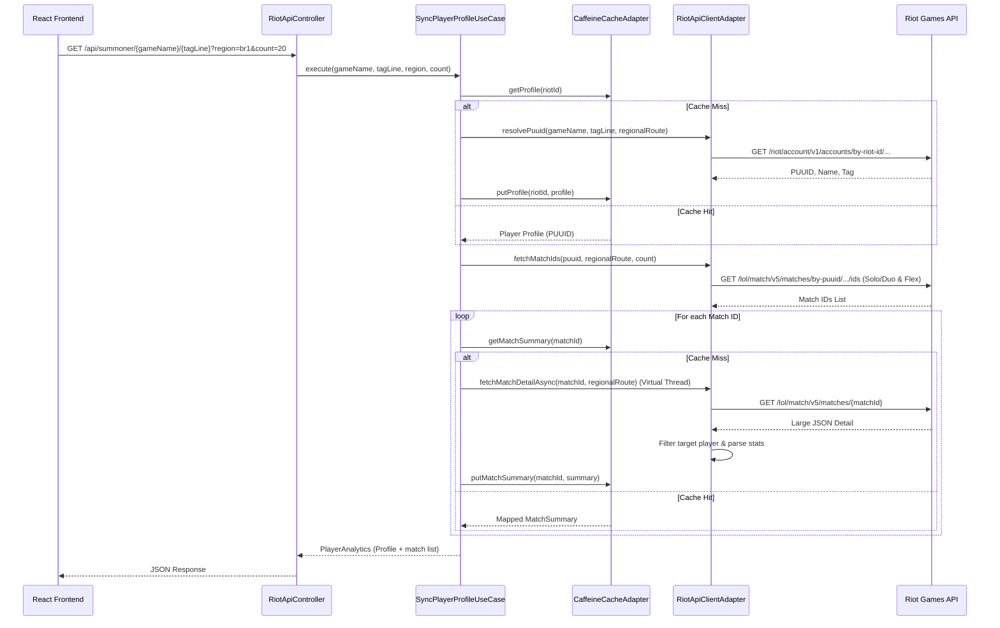

# Feature Technical Specification: Riot API Integration

## Status

Status: Confirmed

Last updated: 2026-06-06

Owner or primary stakeholder: lucas.dourado

## Product Name

Analysis.GG

## Feature Reference

`docs/features/riot-api-integration/feature.md`

Target output path: `docs/features/riot-api-integration/tech-spec.md`

## Source Documents

| Source | Location or Reference | Type | Status | Notes |
| --- | --- | --- | --- | --- |
| Feature | [feature.md](file:///c:/Users/lucas.dourado/IdeaProjects/analysis-gg/docs/features/riot-api-integration/feature.md) | Feature | Confirmed | Primary feature source |
| Project Planning | [project-planning.md](file:///c:/Users/lucas.dourado/IdeaProjects/analysis-gg/docs/planning/analysis-gg/project-planning.md) | Planning | Confirmed | MVP context, phases, dependencies |
| Technology Definition | [technology-definition.md](file:///c:/Users/lucas.dourado/IdeaProjects/analysis-gg/docs/architecture/analysis-gg/technology-definition.md) | Technology definition | Confirmed | Confirmed stack and constraints |

## Specification Scope

This specification covers the backend REST API proxy endpoints, Riot API client integration (Account-V1, Match-V5), regional server routing mappings, parallel HTTP fetching with Java 21 Virtual Threads, Caffeine caching strategy, data schemas, error handling, validation, and testing strategy for the **Riot API Integration** feature.

## Feature Summary

The Riot API Integration feature provides a proxy service that securely connects the React frontend to the Riot Games API. It resolves a player's Riot ID (`Name#Tagline`) and platform region to a PUUID, retrieves their recent ranked Solo/Duo and Flex match histories, caches player profiles and match details locally for 15 minutes using Caffeine to protect API rate limits, and returns a parsed, lightweight summary payload to the frontend.

## Feature Goal

Retrieve the player's PUUID using their Riot ID (Name#Tagline) and ingest their recent ranked match history details from the Riot Games Match-V5 API.

## Product Completion Criteria

- [ ] PUUID fetched from Riot ID successfully.
- [ ] Recent match list retrieved (up to 100).
- [ ] Match details parsed, keeping only ranked Solo/Duo and Flex matches.
- [ ] Graceful error rendering for Riot API outages or limits.

## Technical Goals

- **Secure Key Management**: Keep the Riot API developer key hidden from the client by routing all requests through the Spring Boot backend proxy.
- **Rate Limit Defense**: Defend the Riot API rate limit (100 req / 2 min) by caching player profiles and match details for 15 minutes using Caffeine.
- **Latency Optimization**: Fetch individual match details in parallel using Java 21 Virtual Threads (`Executors.newVirtualThreadPerTaskExecutor()`).
- **Data Reduction**: Parse massive Riot Match-V5 payloads (~100KB each) into a compact, customized `MatchSummary` schema (<1KB) containing only the target player's stats to minimize network overhead.
- **On-Demand/Chunked Sync**: Fetch only the number of matches requested by the frontend (`count` parameter) rather than forcing 100 lookups, leveraging caching for incremental loads.

## Non-Goals

- Persistent storage of match history (all caching is transient in-memory).
- Fetching or analyzing non-ranked matches (ARAMs, Normals, Arena).
- Direct client-side calls to the Riot API.

## Confirmed Technology Decisions

| Area | Decision          | Source | Applies To | Notes |
| --- |-------------------| --- | --- | --- |
| **Backend Language** | Java 21           | `technology-definition.md` | Backend source code | Runtime language |
| **Backend Framework** | Spring Boot 4.0.x | `technology-definition.md` | Backend REST server | API and resource serving |
| **Caching Library** | Caffeine Cache    | `technology-definition.md` | In-memory cache | 15-minute write-based eviction |
| **Build System** | Maven             | `technology-definition.md` | Root workspace config | Project compilation |
| **Concurrency** | Virtual Threads   | `technology-definition.md` / Java 21 | Parallel match fetching | Lightweight task execution |

## Pending Technology Decisions

| Area | Pending Decision | Impact on Feature | Required Next Step |
| --- | --- | --- | --- |
| None | None | None | None |

## Applicable Guidelines and References

| Reference | Path | Applies To | Usage |
| --- | --- | --- | --- |
| Java Coding Guidelines | [.agents/docs/architecture/coding-guidelines/README.md](file:///c:/Users/lucas.dourado/IdeaProjects/analysis-gg/.agents/docs/architecture/coding-guidelines/README.md) | Backend packages, modules, classes | Architecture, modular organization, names |
| Caffeine Reference | [caffeine.md](file:///c:/Users/lucas.dourado/IdeaProjects/analysis-gg/docs/references/analysis-gg/technologies/caffeine.md) | In-memory caching logic | Config specs and eviction rules |
| Spring Boot Reference | [springboot.md](file:///c:/Users/lucas.dourado/IdeaProjects/analysis-gg/docs/references/analysis-gg/technologies/springboot.md) | RestController, configuration | Endpoints and SPA fallback routing |

## Proposed Technical Approach

1. **Routing and Region Mapping**:
   The frontend routes lookups to the Spring Boot backend proxy. The backend accepts a platform region parameter (e.g., `br1`) and maps it to a regional routing value:
   - `br1`, `na1` -> `americas.api.riotgames.com`
   - `euw1`, `eune1` -> `europe.api.riotgames.com`
   - `kr` -> `asia.api.riotgames.com`
   All Riot API requests use HTTPS and include the `X-Riot-Token` header.

2. **PUUID Resolution**:
   - Query: `/riot/account/v1/accounts/by-riot-id/{gameName}/{tagLine}`
   - Result: Retrieve and cache the `puuid` for the given Riot ID.

3. **Match ID Ingestion**:
   - Query 1: `/lol/match/v5/matches/by-puuid/{puuid}/ids?queue=420&count={count}` (Solo/Duo)
   - Query 2: `/lol/match/v5/matches/by-puuid/{puuid}/ids?queue=440&count={count}` (Flex)
   - The backend merges the lists, removes duplicates, sorts them lexicographically (which corresponds to chronological order), and truncates to the requested `count`.

4. **Concurrent Fetching & Caching**:
   - For each match ID, check if its parsed `MatchSummary` exists in the Caffeine `matchDetailCache`.
   - For cache misses, fetch the full match details from `/lol/match/v5/matches/{matchId}` concurrently using Virtual Threads.
   - Parse the JSON, extract the target player's stats, and cache the mapped `MatchSummary` in `matchDetailCache`.

5. **Aggregation & Response**:
   - Return the combined player profile and the list of `MatchSummary` records to the client.

## Architecture Notes

Following Java Backend Clean Architecture coding guidelines, the logic is organized under a modular package structure:

```
src/main/java/com/analysisgg/modules/riotapi/
  domain/
    model/          # RiotAccount, MatchSummary, PlayerAnalytics
    valueobject/    # RiotId, Puuid, Region
  application/
    usecase/        # SyncPlayerProfileUseCase (orchestrates lookup, fetches, caches)
    port/           # RiotApiClientPort, PlayerProfileCachePort
  adapter/
    in/web/         # RiotApiController (RestController exposing endpoint)
    out/
      integration/  # RiotApiClientAdapter (calls Riot API endpoints via RestClient)
      cache/        # CaffeineCacheAdapter (manages Caffeine cache instances)
  infrastructure/
    integration/    # Web configuration, HttpClient configurations
    cache/          # Caffeine cache beans setup
  RiotApiModuleConfiguration.java
```

### Flow Diagram



## Modules and Responsibilities

| Module or Component | Responsibility | Inputs | Outputs | Notes |
| --- | --- | --- | --- | --- |
| `RiotApiController` | Exposes proxy endpoint, validates path and query parameters, and maps results to HTTP response. | `gameName`, `tagLine` (paths), `region`, `count` (queries) | `ResponseEntity<PlayerAnalyticsResponse>` | HTTP Rest Controller |
| `SyncPlayerProfileUseCase` | Core orchestrator. Resolves PUUID, fetches match list, checks caches, triggers parallel fetches, and constructs results. | `gameName`, `tagLine`, `region`, `count` | `PlayerAnalytics` (Domain model) | Application Service |
| `RiotApiClientPort` | Port contract defining external Riot API operations. | Various | Various | Application Port Interface |
| `PlayerProfileCachePort` | Port contract defining caching operations. | Various | Various | Application Port Interface |
| `RiotApiClientAdapter` | Connects to Riot API endpoints using Spring `RestClient`, maps regional routes, and handles HTTP errors. | API requests, headers | JSON payloads | Outbound Adapter |
| `CaffeineCacheAdapter` | Interacts with Caffeine in-memory cache beans to get/put values. | Cache keys, values | Cached objects | Outbound Adapter |

## Integration Contracts

| Producer | Consumer | Contract | Notes |
| --- | --- | --- | --- |
| `RiotApiController` | React Frontend | REST API `/api/summoner/{gameName}/{tagLine}?region={region}&count={count}` returning `PlayerAnalyticsResponse` | Frontend calls this to populate the dashboard |
| `RiotApiClientAdapter` | Riot Games API | HTTP endpoints on regional subdomains using `X-Riot-Token` auth header | Backend calls Riot API |

## Data Model

`Not applicable` — No persistent database model exists. All entities are domain/transient models.

## Data Contracts

### `PlayerAnalyticsResponse` (Backend to Frontend)

```json
{
  "puuid": "string",
  "gameName": "string",
  "tagLine": "string",
  "region": "string",
  "matches": [
    {
      "matchId": "string",
      "gameDuration": 1800,
      "gameCreation": 1785984000000,
      "queueId": 420,
      "win": true,
      "championId": 103,
      "championName": "Ahri",
      "kills": 8,
      "deaths": 2,
      "assists": 12,
      "totalMinionsKilled": 180,
      "neutralMinionsKilled": 12
    }
  ]
}
```

## API or Interface Design

### Backend REST API Endpoint

| Interface | Method or Type | Request/Input | Response/Output | Errors | Notes |
| --- | --- | --- | --- | --- | --- |
| `/api/summoner/{gameName}/{tagLine}` | GET | Path: `gameName` (string), `tagLine` (string)<br>Query: `region` (string), `count` (int, optional, default: 20) | `PlayerAnalyticsResponse` | `400` Invalid format/region<br>`404` Profile not found<br>`429` Rate limit exceeded<br>`500` Server/Riot error | Proxy endpoint for player lookup |

### Riot Games API Endpoints Used

| Endpoint | Subdomain | Request / Parameters | Response |
| --- | --- | --- | --- |
| `/riot/account/v1/accounts/by-riot-id/{gameName}/{tagLine}` | `americas` / `europe` / `asia` | Path variables, `X-Riot-Token` header | Account JSON (puuid, gameName, tagLine) |
| `/lol/match/v5/matches/by-puuid/{puuid}/ids` | `americas` / `europe` / `asia` | `start=0`, `count=100`, `queue=420` (or `440`), `X-Riot-Token` | Array of Match ID strings |
| `/lol/match/v5/matches/{matchId}` | `americas` / `europe` / `asia` | Path variable, `X-Riot-Token` | Detail Match JSON (metadata, participants, info) |

## State and Error Handling

| State or Error | Trigger | Expected Behavior | User/System Feedback | Notes |
| --- | --- | --- | --- | --- |
| Loading | API fetch is in progress | Keep HTTP request pending. | Frontend displays a sleek loading skeleton. | Managed client-side. |
| Success | Data retrieved successfully | Return HTTP `200 OK` with JSON payload. | Frontend populates and shows dashboard. | TBD |
| Empty (No matches) | Player has no Solo/Duo or Flex games | Return HTTP `200 OK` with empty `matches` array. | Frontend renders dashboard with empty states / warnings. | Must not fail or crash. |
| Invalid Input | Region or Riot ID parameters fail validation | Return HTTP `400 Bad Request`. | Frontend renders validation error tooltip. | Validated on Controller. |
| Profile Not Found | Riot ID does not exist | Return HTTP `404 Not Found`. | Frontend renders `"Player not found"` error banner. | Riot API returns 404. |
| Rate Limited (429) | Riot API rate limits are hit | Return HTTP `429 Too Many Requests`. | Frontend displays rate limit warning / retry indicator. | Check headers or retry after. |
| Unauthorized (403) | API key is invalid or expired | Return HTTP `500 Internal Server Error` (or `403` log). | System logs 403; user sees generic server configuration error. | Developer key needs renewal. |
| Timeout (504) | Riot API takes too long to respond | Return HTTP `504 Gateway Timeout`. | User sees `"Connection timeout. Please retry."` message. | Set HTTP Client timeout to 5s. |

## Validation Rules

| Validation | Applies To | Enforcement Point | Error Behavior | Notes |
| --- | --- | --- | --- | --- |
| **Riot ID Format** | `gameName` & `tagLine` | Controller / Route | Aborts processing; returns `400 Bad Request`. | Match regex: `^[a-zA-Z0-9\s_.-]{3,16}$` and `^[a-zA-Z0-9]{3,5}$` |
| **Region White List** | `region` query param | Controller | Aborts processing; returns `400 Bad Request`. | Must be one of: `br1`, `na1`, `euw1`, `eune1`, `kr` |
| **Count Range** | `count` query param | Controller | Coerces to default (20) if out of bounds. | Allowed range: `1` to `100` |

## Security and Permissions

- **Secret Key Protection**: The Riot API key is loaded via Spring Boot's `@Value("${riot.api.key}")` (mapped from the environment variable `RIOT_API_KEY`). It is never returned in HTTP responses or exposed to the client.
- **Path Sanitization**: Ensure path parameters are properly encoded when forwarding to Riot API to prevent HTTP response splitting or path injection.

## Observability and Logging

| Signal | Purpose | Source | Consumer | Notes |
| --- | --- | --- | --- | --- |
| Cache Hit/Miss Logs | Track caching efficiency | `CaffeineCacheAdapter` | System Logs (`slf4j`) | Debug level logs |
| HTTP Failure Logs | Alert on API key expiration or rate limits | `RiotApiClientAdapter` | System Logs / Alerts | Logs HTTP status code and URL |

## Performance Considerations

- **Parallel Fetching**: Fetching 50 matches sequentially takes ~10 seconds. Fetching them in parallel via Java 21 Virtual Threads reduces latency to the duration of the single slowest HTTP request (~200ms - 500ms).
- **Caching**: 15-minute Caffeine cache for player profiles prevents rate limit exhaustion for active users. Match detail caching for 24 hours drastically reduces outgoing requests since match details are immutable.

## Compatibility and Migration Notes

- **Vite Proxy Config**: During development, `vite.config.ts` must map `/api` requests to Spring Boot (`http://localhost:8080`).

## Testing Strategy

| Test Type | What to Validate | Required? | Notes |
| --- | --- | --- | --- |
| Unit | Correct parsing of Riot API JSON to `MatchSummary` record. | Yes | Test with mock JSON payloads. |
| Unit | Validation checks on controller input parameters. | Yes | Verify `400 Bad Request` on invalid region/names. |
| Integration | Caffeine caching eviction and read/write operations. | Yes | Mock the Riot client port and assert cache behavior. |
| Integration | Concurrent fetching behavior with virtual threads. | Yes | Use MockWebServer/WireMock to simulate slow Riot API responses. |

## Risks and Trade-offs

| Risk or Trade-off | Impact | Likelihood | Mitigation or Follow-Up | Status |
| --- | --- | --- | --- | --- |
| **Riot API Rate Limiting** | High | High | Implement Caffeine cache for player profiles (15 mins) and match details (24 hours). Fetch match list with queue filters directly to minimize detail fetch requests. | Mitigated |
| **Riot API Key Expiration (24h)** | High | High | The system will log a distinct warning when a 403 Forbidden is returned from Riot API, making it easy to spot and rotate the key. | Accepted |

## Assumptions

- The project workspace will be configured as a Spring Boot Maven project using Java 21.
- The environment variable `RIOT_API_KEY` will be supplied in the runtime environment.

## Open Questions

| Question | Impact | Blocks Create Tasks? | Suggested Owner |
| --- | --- | --- | --- |
| Should we fetch match lists per queue in parallel? | Low | No | Tech |

*Resolution of the initial planning question*: To prevent rate-limiting and minimize latency, the backend will support a `count` parameter (default 20, max 100). When the user views 20 games, only 20 details are fetched. If they click 50 or 100, the cached 20 are reused instantly, and only the new 30 or 80 details are fetched from Riot API. This on-demand/chunked sync prevents rate-limiting issues.

## Feature Technical Readiness

Status: Ready for Task Breakdown

Reason: All endpoint schemas, region mapping rules, caching parameters, parallel execution models, and Clean Architecture structures are defined and aligned with the project's requirements.

## Feature Technical Readiness Checklist

- [x] Feature scope is clear.
- [x] Product completion criteria are understood.
- [x] Technology decisions are confirmed.
- [x] Applicable guidelines and references are listed.
- [x] Integration contracts are defined.
- [x] Data model is marked as not applicable.
- [x] Data contracts are defined.
- [x] State and error handling are defined.
- [x] Validation rules are defined.
- [x] Security/permission considerations are defined.
- [x] Testing strategy is defined.
- [x] Blocking open questions are resolved.
- [x] Inputs for `create-tasks` are clear.

## Inputs for Create Tasks

- Create tasks for Maven dependencies setup (Spring Boot starter web, Caffeine Cache, testing libraries).
- Create tasks for domain model, value objects, and exception classes.
- Create tasks for Riot API Http Client (RiotApiClientAdapter) and regional routing configurations.
- Create tasks for Caffeine Cache configuration and adapter (CaffeineCacheAdapter).
- Create tasks for SyncPlayerProfileUseCase orchestrator and its unit tests.
- Create tasks for RiotApiController exposing `/api/summoner/{gameName}/{tagLine}` and its validation rules.
- Create tasks for integration tests (WireMock verification of API error flows and rate limits).

## ADR Candidates

- None. (Local Caffeine caching and Spring Boot REST proxy were already decided in the Technology Definition).

## Next Recommended Steps

- Run the `create-tasks` workflow to break down this specification into actionable implementation tasks under `docs/features/riot-api-integration/tasks/`.
