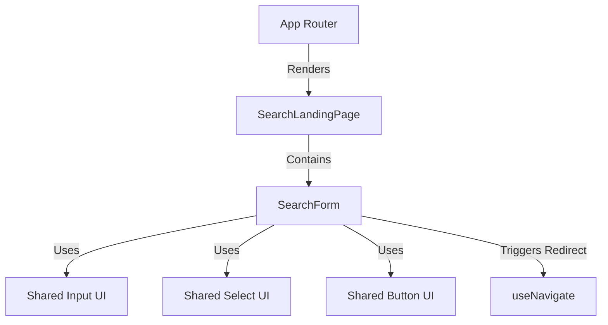

# Feature Technical Specification: Riot ID Search Input

## Status

Status: Confirmed
Last updated: 2026-06-05
Owner or primary stakeholder: lucas.dourado

## Product Name

Analysis.GG

## Feature Reference

`docs/features/riot-id-search-input/feature.md`

Target output path: `docs/features/riot-id-search-input/tech-spec.md`

## Source Documents

| Source | Location or Reference | Type | Status | Notes |
| --- | --- | --- | --- | --- |
| Feature | [feature.md](file:///c:/Users/lucas.dourado/IdeaProjects/analysis-gg/docs/features/riot-id-search-input/feature.md) | Feature | Confirmed | Primary feature source |
| Project Planning | [project-planning.md](file:///c:/Users/lucas.dourado/IdeaProjects/analysis-gg/docs/planning/analysis-gg/project-planning.md) | Planning | Confirmed | MVP context, phases, dependencies |
| Technology Definition | [technology-definition.md](file:///c:/Users/lucas.dourado/IdeaProjects/analysis-gg/docs/architecture/analysis-gg/technology-definition.md) | Technology definition | Confirmed | Confirmed stack and constraints |

## Specification Scope

This specification details the technical design, directory structure, user interface components, styling rules, input validation regular expressions, client-side routing redirects, and testing plan for the landing page onboarding form.

## Feature Summary

A responsive onboarding landing page featuring a search form. It allows users to input their Riot ID (`GameName#TagLine`) and select their target platform region. The form validates the formatting client-side, displays a tooltip for empty or invalid inputs, and redirects the user to the dashboard with query parameters on successful submit.

## Feature Goal

Render a search interface that accepts a user's Riot ID and region, validating the input format before redirecting the user to the analytics dashboard.

## Product Completion Criteria

- [ ] Riot ID input validates format (`Name#Tagline`) before allowing submit.
- [ ] Region selection dropdown is populated with supported servers.
- [ ] Clicking "Analyze" redirects user to `/dashboard` with query parameters.
- [ ] Empty state input shows error tooltip when clicking "Analyze".

## Technical Goals

- Establish a premium, high-fidelity landing page with a modern dark-mode aesthetic (obsidian palette, glassmorphic card, glowing focus states, and smooth transition animations).
- Enforce strict input validation before form submission.
- Standardize region server configuration options to align with the Riot API backend's platform IDs.
- Ensure the component structure follows the React Clean Architecture features layout (`src/features/search/presentation/...`).
- Establish a complete unit testing suite verifying input constraints, validation visual states, and routing calls.

## Non-Goals

- Direct integration with the Riot Games API (this is handled on the backend proxy server after redirection).
- Search autocomplete or recent searches dropdowns.
- Storing searched Riot IDs in local databases or storage (lookups are transient via query parameters).

## Confirmed Technology Decisions

| Area | Decision | Source | Applies To | Notes |
| --- | --- | --- | --- | --- |
| **Frontend Framework** | React (Vite + TS) | `technology-definition.md` | Whole frontend | Type-safe React components |
| **Routing** | React Router (`react-router-dom`) | `project-structure.md` | Routing configuration | Path routing resolver |
| **UI Styling** | Vanilla CSS (CSS Modules) | `technology-definition.md` | Form styling | Component-specific styling sheets |
| **State Management** | React Hooks (`useState`) | `technology-definition.md` | Form interaction | Client-side input state management |

## Pending Technology Decisions

| Area | Pending Decision | Impact on Feature | Required Next Step |
| --- | --- | --- | --- |
| None | None | None | None |

## Applicable Guidelines and References

| Reference | Path | Applies To | Usage |
| --- | --- | --- | --- |
| React Coding Guidelines | [.agents/docs/architecture/react-coding-guidelines/](file:///c:/Users/lucas.dourado/IdeaProjects/analysis-gg/.agents/docs/architecture/react-coding-guidelines/) | Component structure | Project-wide frontend layout |
| Component Guidelines | [.agents/docs/architecture/react-coding-guidelines/component-guidelines.md](file:///c:/Users/lucas.dourado/IdeaProjects/analysis-gg/.agents/docs/architecture/react-coding-guidelines/component-guidelines.md) | Component modularity | UI and state separation |
| Styling Guidelines | [.agents/docs/architecture/react-coding-guidelines/styling-guidelines.md](file:///c:/Users/lucas.dourado/IdeaProjects/analysis-gg/.agents/docs/architecture/react-coding-guidelines/styling-guidelines.md) | CSS design | Layout variables & module structure |

## Proposed Technical Approach

1. **Routing and Page Composition**:
   - Map `/` to `SearchLandingPage` in `src/app/routes.tsx`.
   - Map `/dashboard` to `DashboardPage` (temporary placeholder during Phase 1).
2. **Form Validation Strategy**:
   - Validate on `onSubmit` and on input `onBlur`.
   - If the input is empty or does not match the Riot ID regex, set the local error state.
   - Prevent navigation if error state is active.
   - Regex pattern: `^[a-zA-Z0-9\s_.-]{3,16}#[a-zA-Z0-9]{3,5}$`
     - Allows 3-16 characters for the game name (alphanumeric, spaces, underscores, dots, hyphens).
     - Followed by a `#` character.
     - Allows 3-5 alphanumeric characters for the tagline.
3. **Region Configuration Mapping**:
   - Create a static config file `src/shared/lib/validation/regions.ts` containing the server region metadata:
     - Name: e.g., "North America", "Brazil", "Europe West"
     - Platform ID: e.g., `NA1`, `BR1`, `EUW1` (Riot API platform routing keys)
4. **UX & UI Styling System**:
   - Establish CSS Variables inside a global stylesheet (`src/index.css`) for the design tokens:
     - Background: Deep obsidian `hsl(220, 25%, 5%)` to `hsl(220, 18%, 10%)` gradient.
     - Card Background: Semi-transparent glass `rgba(13, 17, 23, 0.7)` with `backdrop-filter: blur(16px)` and a subtle border `1px solid rgba(255, 255, 255, 0.08)`.
     - Accent: Cyberpunk neon gradient (Cyan `hsl(180, 100%, 50%)` to Emerald `hsl(150, 100%, 45%)`).
     - Error: Glow red `hsl(350, 80%, 55%)`.
   - Apply CSS Modules (`*.module.css`) to the search components to isolate states and layout classes.

## Architecture Notes

The feature follows the **Clean Architecture Presentation Layer** guidelines. The search form component is split from the main landing page wrapper to ensure reusability and ease of testing.

### Folder Layout
- `src/features/search/presentation/pages/SearchLandingPage.tsx`
- `src/features/search/presentation/components/SearchForm.tsx`
- `src/features/search/presentation/components/SearchForm.module.css`
- `src/shared/ui/Input/Input.tsx`
- `src/shared/ui/Input/Input.module.css`
- `src/shared/ui/Select/Select.tsx`
- `src/shared/ui/Select/Select.module.css`
- `src/shared/ui/Button/Button.tsx`
- `src/shared/ui/Button/Button.module.css`

## Modules and Responsibilities

| Module or Component | Responsibility | Inputs | Outputs | Notes |
| --- | --- | --- | --- | --- |
| `SearchLandingPage` | Container page rendering the background theme, brand title, and form layout. | None | JSX Layout | Simple container |
| `SearchForm` | Manages form fields state, handles submission events, performs validation checks, and triggers redirection. | None | JSX Form | Logic coordinator |
| `Input` | Standard controlled text input with support for active/error state styles. | `value`, `onChange`, `placeholder`, `error` (boolean), etc. | JSX Input | Shared component |
| `Select` | Controlled select list for region selection. | `value`, `onChange`, `options` (array) | JSX Select | Shared component |
| `Button` | Interactive button displaying hover gradients and support for disabled states. | `onClick`, `disabled`, `type`, `children` | JSX Button | Shared component |

## Integration Contracts

| Producer | Consumer | Contract | Notes |
| --- | --- | --- | --- |
| `SearchForm` | `DashboardPage` | Redirection url structure with URI parameters: `/dashboard?name={encodeURIComponent(gameName)}&tag={encodeURIComponent(tagLine)}&region={region.toLowerCase()}` | Triggers via React Router `useNavigate()` |

## Data Model

`Not applicable` — This feature is client-side only and does not declare or persist persistent database or domain entities.

## Data Contracts

### `RiotIdQueryParams`

URL query parameters passed to the `/dashboard` route.

| Field | Type | Description | Example |
| --- | --- | --- | --- |
| `name` | string | Riot account game name (3-16 chars) | `Hide on bush` |
| `tag` | string | Riot account tagline (3-5 chars) | `KR1` |
| `region` | string | Riot API platform server (lowercase, matching standard APIs) | `kr` |

## API or Interface Design

### Routes Layout

| Interface | Method or Type | Request/Input | Response/Output | Errors | Notes |
| --- | --- | --- | --- | --- | --- |
| `/` | Route | None | Renders `SearchLandingPage` | None | Landing Page route |
| `/dashboard` | Route | `?name=String&tag=String&region=String` | Renders `DashboardPage` | Displays search errors on fetch fail | Handled by Dashboard feature |

## State and Error Handling

| State or Error | Trigger | Expected Behavior | User/System Feedback | Notes |
| --- | --- | --- | --- | --- |
| **Initial / Empty** | Page first loads | Display blank Riot ID input field and default selected region (e.g. `NA1`). | Form inputs are clean, button is active. | No warnings shown. |
| **Typing** | User modifies Riot ID input | Keep local state synchronized. Clear error highlights if user corrects format. | Input border turns to cyan focus glow; tooltips are hidden. | Standard focus behavior. |
| **Invalid Input (Regex mismatch)** | User enters malformed string (e.g., missing `#`, tagline too long) and hits "Analyze" or focuses out | Set error state to `"Invalid format. Use Name#Tag (e.g., Hide on bush#KR1)"`. Prevent submit. | Outline input in neon red `hsl(350, 80%, 55%)`. Show tooltip directly underneath input. | Blocks form submission. |
| **Invalid Input (Empty submission)** | User leaves input blank and hits "Analyze" | Set error state to `"Riot ID is required"`. Prevent submit. | Outline input in red. Show tooltip stating `"Riot ID is required"`. | Blocks form submission. |
| **Valid Submission** | User enters valid Riot ID + Region and submits | Trigger route redirect. Set redirection loading state. | Disable inputs and submit button. Animate button to showcase loading spinner/transition. | Seamless loading transition. |

## Validation Rules

| Validation | Applies To | Enforcement Point | Error Behavior | Notes |
| --- | --- | --- | --- | --- |
| **Presence Check** | `riotId` input | `onSubmit` | Aborts submit; sets error state: `"Riot ID is required"`. | Client-side block |
| **Format Regex Matching** | `riotId` input | `onSubmit` & `onBlur` | Aborts submit; sets error state: `"Invalid format. Use Name#Tag"`. | Regex: `^[a-zA-Z0-9\s_.-]{3,16}#[a-zA-Z0-9]{3,5}$` |
| **Region Verification** | `region` select | `onSubmit` | Verifies selected region is part of the statically allowed platform IDs list. | Safety check |

## Security and Permissions

- **XSS Prevention**: Clean query parameters using standard `encodeURIComponent` before inserting them into the URL parameter construction.
- **Client Sanitization**: Strip potential HTML/script tags from the search input before submitting/parsing.

## Observability and Logging

- **Validation Failures**: Log validation failures console-side under `console.warn` to track onboarding issues during local development.

## Performance Considerations

- **Visual Assets**: Static assets (such as background textures or icons) must be optimized. Styling layout rules should favor GPU-accelerated CSS properties (`transform`, `opacity`) for smooth transition animations.
- **Component Lifecycle**: Form state changes are local to `SearchForm` to prevent unnecessary root-level or layout re-renders.

## Compatibility and Migration Notes

- **Responsive View**: Flexbox and CSS Grid layout scales fluidly from desktop sizes down to mobile screen widths (320px).
- **CSS Modifiers**: Utilizes standard modern CSS rules supported by all evergreen browsers (Chrome, Firefox, Safari, Edge).

## Testing Strategy

| Test Type | What to Validate | Required? | Notes |
| --- | --- | --- | --- |
| **Unit** | Form fields render correctly (Riot ID input, region dropdown, button). | Yes | Verify standard elements present. |
| **Unit** | Input validation catches empty field on submit. | Yes | Verify tooltip states `"Riot ID is required"`. |
| **Unit** | Input validation catches malformed formatting (e.g. `Name`, `Name#`, `Na#12`). | Yes | Verify tooltip displays correct regex instructions. |
| **Unit** | Valid submissions successfully call routing redirect with correctly mapped query params. | Yes | Mock `useNavigate` and assert target URL. |

## Risks and Trade-offs

| Risk or Trade-off | Impact | Likelihood | Mitigation or Follow-Up | Status |
| --- | --- | --- | --- | --- |
| **Complex Summoner Names** | Medium | Low | Adjust regex if Riot extends character allowances (e.g., spaces/special symbols in other regions). | Open |
| **Browser Compatibility of Backdrop Blur** | Low | Low | Apply standard fallback solid backgrounds if CSS `backdrop-filter: blur()` is unsupported. | Mitigated |

## Assumptions

- A dashboard route `/dashboard` is mapped and capable of extracting the parsed `name`, `tag`, and `region` query variables.
- Standard client-side routing library `react-router-dom` is configured in `src/app/routes.tsx`.

## Open Questions

| Question | Impact | Blocks Create Tasks? | Suggested Owner |
| --- | --- | --- | --- |
| Should we pre-select the region based on the user's IP/location? | Low | No | Product / UI |

## Feature Technical Readiness

Status: Ready for Task Breakdown

Reason: All technical scope boundaries, validation logic, styling guidelines, and test parameters are fully outlined and agreed upon.

## Feature Technical Readiness Checklist

- [ ] Feature scope is clear.
- [ ] Product completion criteria are understood.
- [ ] Technology decisions are confirmed.
- [ ] Applicable guidelines and references are listed.
- [ ] Integration contracts are defined or marked as not applicable.
- [ ] Data model is defined or marked as not applicable.
- [ ] Data contracts are defined or marked as not applicable.
- [ ] State and error handling are defined.
- [ ] Validation rules are defined or marked as not applicable.
- [ ] Security/permission considerations are defined or marked as not applicable.
- [ ] Testing strategy is defined.
- [ ] Blocking open questions are resolved.
- [ ] Inputs for `create-tasks` are clear.

## Inputs for Create Tasks

- Create tasks for UI component markup and responsive layout styling (landing page layout + glassmorphic card).
- Create tasks for client-side Riot ID regex validation and form state management hooks (`useState`).
- Create tasks for region selector config file creation and dropdown rendering mapping.
- Create tasks for routing setup and URL query parameters helper utility.
- Create tasks for unit testing the search form (validation triggers, visual states, and navigate triggers).

## ADR Candidates

None. (No new foundational architectural decisions are required for this pure frontend component).

## Next Recommended Steps

- Run the `create-tasks` workflow to break down the approved specification into individual implementation tasks.
