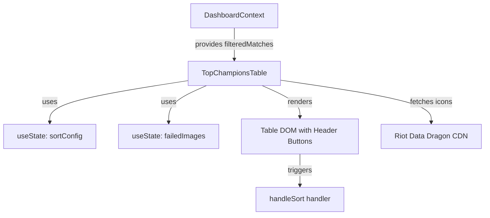

# Feature Technical Specification: Top Champions Stats Table

## Status

Status: Confirmed

Last updated: 2026-06-06

Owner or primary stakeholder: lucas.dourado

## Product Name

Analysis.GG

## Feature Reference

`docs/features/top-champions-stats-table/feature.md`

Target output path: `docs/features/top-champions-stats-table/tech-spec.md`

## Source Documents

List the source documents and user-provided context used for this specification.

| Source | Location or Reference | Type | Status | Notes |
| --- | --- | --- | --- | --- |
| Feature | `docs/features/top-champions-stats-table/feature.md` | Feature | Confirmed | Primary feature source |
| Project Planning | `docs/planning/analysis-gg/project-planning.md` | Planning | Confirmed | MVP context, phases, dependencies |
| Technology Definition | `docs/architecture/analysis-gg/technology-definition.md` | Technology definition | Confirmed | Confirmed stack and constraints |

---

## Specification Scope

This specification covers the design, formulas, user interaction (interactive column sorting), asset fetching (Riot Data Dragon CDN), styling, state management, and testing strategy for the **Top Champions Stats Table** frontend component of the **Analysis.GG** dashboard.

---

## Feature Summary

The Top Champions Stats Table aggregates a player's match statistics (wins, losses, kills, deaths, assists, creep score, and duration) on a per-champion basis for the matches within the active filter range (20/50/100 games). It displays this data in a sleek, sortable table. It includes:
1. Champion name/icon
2. Total Games played
3. Win Rate (%)
4. Average KDA ratio
5. Average CS/min

---

## Feature Goal

Aggregate match statistics on a per-champion basis from the player's recent matches, calculate key performance metrics (Win Rate, KDA, CS/min), and render them in a clean table sorted descending by Win Rate by default, with support for interactive sorting.

---

## Product Completion Criteria

- [x] Champion stats calculated accurately based on match scope.
- [x] Table lists champion entries.
- [x] Sorted descending by Win Rate by default.
- [x] Displays champion icons (if static assets exist) or name.

---

## Technical Goals

- **Interactive Sorting**: Allow sorting by Champion Name, Played, Win Rate, KDA, and CS/min (descending/ascending) when clicking the table headers.
- **Accurate Formulas**: Correctly calculate Win Rate, KDA ratio, and CS/min, handling edge cases such as division by zero (e.g., 0 deaths, 0 duration).
- **Asset Integration**: Dynamically load champion portrait icons from Riot's Data Dragon CDN with graceful fallback behavior (e.g., circular letter placeholder or hiding broken images) to handle load errors.
- **Responsive Theme Consistency**: Match the Obsidian dark-theme design system (using HSL colors, glassmorphism backdrop-filters, custom CSS variables, and clean transitions).
- **Comprehensive Unit Testing**: Write tests validating data aggregation, default sorting, interactive header sorting, empty states, and fallback error handling.

---

## Non-Goals

- Fetching champion data directly from external APIs (data is aggregated from the local frontend state `filteredMatches`).
- Persisting champion statistics or custom sort preferences.
- Custom filtering of specific champions in the table (handled globally by the Match Range Filter).

---

## Confirmed Technology Decisions

| Area | Technology | Source | Applies To | Notes |
| --- | --- | --- | --- | --- |
| **Frontend Language** | React (Vite + TS) | `technology-definition.md` | Frontend source code | Strong type-safety for complex schemas |
| **UI Styling** | Vanilla CSS | `technology-definition.md` / rules | Component styles | Customized CSS modules |
| **State Management** | Context API & useState | `technology-definition.md` | Component state | Tracking active sorting columns |
| **Testing Framework** | Vitest + React Testing Library | `technology-definition.md` | Unit/UI testing | Component behavior assertions |

---

## Pending Technology Decisions

| Area | Pending Decision | Impact on Feature | Required Next Step |
| --- | --- | --- | --- |
| None | None | None | None |

---

## Applicable Guidelines and References

| Reference | Path | Applies To | Usage |
| --- | --- | --- | --- |
| React Coding Guidelines | `.agents/docs/architecture/react-coding-guidelines/` | React components | Architecture, styling, testing |
| Component styling guidelines | `.agents/docs/architecture/react-coding-guidelines/styling-guidelines.md` | CSS Modules | Custom styling rules, HSL variables |

---

## Proposed Technical Approach

### 1. Data Aggregation
The component reads `filteredMatches` from `useDashboard()`. It iterates through the matches, grouping stats by `championName`. For each champion, it accumulates:
- `wins` and `losses` (based on `match.win`)
- `kills`, `deaths`, and `assists`
- `totalCs` (sum of `match.totalMinionsKilled` and `match.neutralMinionsKilled`)
- `totalDurationSeconds` (sum of `match.gameDuration`)

### 2. Metrics Computation
- **Win Rate**: `Math.round((wins / gamesPlayed) * 100)`
- **CS/min**: `(totalCs / (totalDurationSeconds / 60))` formatted to 1 decimal place. If duration is 0, defaults to `'0.0'`.
- **KDA Ratio**: `(kills + assists) / deaths`.
  - **Zero Deaths Handling**: If `deaths` is 0, the KDA is considered **Perfect**.
  - **Sorting KDA**: To sort numeric KDAs alongside Perfect KDAs fairly:
    - If `deaths === 0`, we compute a sorting helper value `kdaValue = kills + assists`.
    - If `deaths > 0`, `kdaValue = (kills + assists) / deaths`.
    - We sort `isPerfectKda` champions to the top when sorting KDA descending, or assign a virtual high value/bonus to Perfect KDA.
  - **KDA Label Formatting**: `Perfect` or `${(rawKda).toFixed(2)}` followed by the average counts breakdown: `Perfect (4.0/0.0/8.0)` or `6.00 (4.0/2.0/8.0)`.

### 3. Champion Portrait Assets
- **Base CDN URL**: `https://ddragon.leagueoflegends.com/cdn/14.11.1/img/champion/{championName}.png`
- **Asset Versioning**: The patch version `14.11.1` will be defined as a configurable constant (`CHAMPION_ASSET_VERSION` inside a config/constant file or locally in the component).
- **Fallback Behavior**: Use an `img` tag with an `onError` handler. If the image fails to load (due to connection issues or a mismatched champion name key), we toggle a fallback state for that champion to hide the image and display a styled placeholder circular container showing the champion's first letter.

### 4. Interactive Sorting State
- **State Properties**: Track the current sort config:
  - `sortKey`: `'championName' | 'gamesPlayed' | 'winRate' | 'kdaValue' | 'csMin'`
  - `sortDirection`: `'asc' | 'desc'`
- **Default Sort**: Sorted descending by `winRate`. If win rates are equal, secondary sort by `gamesPlayed` descending, then `championName` ascending.
- **Header Interaction**: Clicking a column header:
  - If a new column is clicked: sort **descending** (or **ascending** for alphabetical names).
  - If the active column is clicked: toggle direction (`desc` -> `asc` -> default default `winRate` desc).
  - Render an indicator arrow next to the active sorted column header (`▲` for ascending, `▼` for descending).

### 5. Styling & Layout
- interactive headers must have `cursor: pointer` and hover states.
- High win rates (>= 60%) will highlight dynamically using cyan accent (`var(--accent-cyan)`).

---

## Architecture Notes

The component is located in `src/main/frontend/src/features/dashboard/presentation/components/TopChampionsTable.tsx`.
It consumes `DashboardContext` data and uses local state for sorting and image error tracking.



---

## Modules and Responsibilities

| Module or Component | Responsibility | Inputs | Outputs | Notes |
| --- | --- | --- | --- | --- |
| `TopChampionsTable.tsx` | React component that handles aggregation, sorting, rendering, and fallback image logic. | None (consumes `useDashboard`) | React Element (data table or empty state) | Frontend View component |
| `TopChampionsTable.module.css` | CSS module defining style overrides, hover states, glassmorphic layout, and indicator icons. | CSS declarations | Styled HTML components | Vanilla CSS file |
| `TopChampionsTable.test.tsx` | Vitest suite that validates the component behavior. | Mock match data | Test execution logs | Unit/UI Test file |

---

## Integration Contracts

| Producer | Consumer | Contract | Notes |
| --- | --- | --- | --- |
| `DashboardContext` | `TopChampionsTable` | `filteredMatches: MatchSummary[]` | Component reads filtered match list from shared context |

---

## Data Model

`Not applicable` — No persistent backend model exists for this frontend-only component.

---

## Data Contracts

### `ChampionStats` (Internal UI Type)
```typescript
interface ChampionStats {
  championName: string;
  gamesPlayed: number;
  wins: number;
  losses: number;
  winRate: number;
  kills: number;
  deaths: number;
  assists: number;
  kdaValue: number;      // Numeric sorting helper
  isPerfectKda: boolean;  // Flag for rendering
  kdaString: string;     // E.g. "Perfect (5.0/0.0/3.0)" or "4.00 (4.0/2.0/4.0)"
  csMin: number;         // Numeric sorting helper
  csMinString: string;   // E.g. "7.5"
}
```

---

## API or Interface Design

- React component: `<TopChampionsTable />`
- Component Props: `{}` (empty object, consumes context).

---

## State and Error Handling

| State or Error | Trigger | Expected Behavior | User/System Feedback | Notes |
| --- | --- | --- | --- | --- |
| **Empty State** | `filteredMatches.length === 0` | Render an empty dashboard widget safely | "No champion statistics to display." | Must not crash |
| **Asset Load Error** | Champion portrait fails to load from CDN | Trigger `onError` and set `failedImages[championName] = true` | Render a styled circle placeholder with the first letter of the champion | No broken image icons shown |
| **Sort Action** | Click on interactive table header | Reorder table records by column value and update arrow indicators | Updated row order, arrow direction changes | Handled by local component state |

---

## Validation Rules

`Not applicable` — Inputs are validated at the API/Controller layer.

---

## Security and Permissions

`Not applicable` — The component only reads client-side aggregated match details.

---

## Observability and Logging

- Console warnings on image load failures are logged natively by browsers, which helps identify broken champion assets.

---

## Performance Considerations

- **Memoization**: Aggregation and sorting logic is wrapped in React's `useMemo` dependent on `filteredMatches` and `sortConfig` to prevent unnecessary calculations on re-render.
- **Payload size**: Matches array sizes are limited to 100 entries, making frontend calculations extremely fast (<1ms).

---

## Compatibility and Migration Notes

- Requires a browser supporting modern Flexbox/Grid layouts and standard CSS custom properties (variables).

---

## Testing Strategy

Vitest + React Testing Library tests under `src/main/frontend/src/features/dashboard/presentation/components/TopChampionsTable.test.tsx`:

| Test Case | What to Validate |
| --- | --- |
| **Data Aggregation** | Verify wins, losses, win rates, KDA, and CS/min are computed correctly from a variety of mock matches. |
| **Default Sorting** | Verify that the table is sorted descending by winRate initially. |
| **Perfect KDA Rendering** | Verify that if a champion has 0 deaths, KDA renders as "Perfect" with correct formulas. |
| **Header Interaction** | Click "Champion", "Played", "Win Rate", "KDA", "CS/min" headers and assert correct sorting behavior and direction toggle. |
| **Fallback Images** | Simulate image `onError` and verify that the circular placeholder fallback is rendered. |
| **Aesthetics** | Verify that champions with win rate >= 60% are styled with the high-win-rate class. |

---

## Risks and Trade-offs

| Risk or Trade-off | Impact | Likelihood | Mitigation or Follow-Up | Status |
| --- | --- | --- | --- | --- |
| **Low Game Count Bias** | Medium | High | A champion played 1 game with 1 win has 100% win rate and sorts to the top. Secondary sorting by games played (descending) is used to break ties. | Mitigated |
| **CDN Version Drift** | Low | Medium | Hardcoded version `14.11.1` won't load icons for champions released in later patches. | Mitigated by moving the patch version to a configuration constant `CHAMPION_ASSET_VERSION`. |

---

## Assumptions

- The `filteredMatches` context array contains only matches with valid durations and stats.

---

## Open Questions

- None. The Riot Data Dragon asset provider and the sorting behavior are confirmed.

---

## Feature Technical Readiness

Status: Confirmed

Reason: The aggregation formulas, sorting states, asset CDN configuration, fallback rendering, and test criteria are detailed and ready.

---

## Feature Technical Readiness Checklist

- [x] Feature scope is clear.
- [x] Product completion criteria are understood.
- [x] Technology decisions are confirmed.
- [x] Applicable guidelines and references are listed.
- [x] Integration contracts are defined.
- [x] Data model is marked as not applicable.
- [x] Data contracts are defined.
- [x] State and error handling are defined.
- [x] Validation rules are marked as not applicable.
- [x] Security/permission considerations are marked as not applicable.
- [x] Testing strategy is defined.
- [x] Blocking open questions are resolved.
- [x] Inputs for `create-tasks` are clear.

---

## Inputs for Create Tasks

- Create tasks for adding sorting state configuration and header action handlers.
- Create tasks for champion stats data structure parsing, KDA calculation, and CS/min calculation.
- Create tasks for Data Dragon CDN icon rendering and fallback `onError` handler logic.
- Create tasks for updating CSS module styles with pointer cursors, sorting indicator arrows, and cyan highlights.
- Create tasks for writing comprehensive unit tests (Vitest + React Testing Library) validating aggregation, sorting, fallbacks, and aesthetics.

---

## ADR Candidates

- None.

---

## Next Recommended Steps

- Run the `create-tasks` workflow to break down this specification into actionable implementation tasks under `docs/features/top-champions-stats-table/tasks/`.
